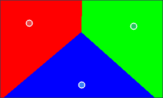
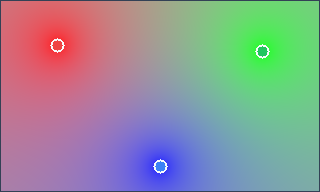
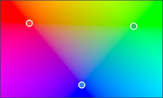

# Influence Field Sampling

Sampling defines how selected sources contribute to the final value at a point.

The examples below use the same source shape:

```csharp
using Akeldov.Math.Spatial2D;
using Akeldov.Math.Spatial2D.Fields;

var sources = new[]
{
    new FloatPointInfluenceSource(1f, new VectorXY(18f, 14f), 0f),
    new FloatPointInfluenceSource(1f, new VectorXY(82f, 16f), 100f),
    new FloatPointInfluenceSource(1f, new VectorXY(50f, 52f), 50f)
};
```

## Nearest Sampling

Nearest sampling returns the value of the closest source.

```csharp
var sampler = new NearestFloatInfluenceSampler<FloatPointInfluenceSource>();
var field = new PointInfluenceFloatField(sampler, sources);

float value = field.Sample(new VectorXY(40f, 30f));
```



## Inverse-Distance Weighted Sampling

Inverse-distance weighted sampling blends all selected sources, weighted by distance and source power.

```csharp
var sampler = new InverseDistanceWeightedFloatSampler<FloatPointInfluenceSource>();
var field = new PointInfluenceFloatField(sampler, sources);

float value = field.Sample(new VectorXY(40f, 30f));
```



## Barycentric Sampling

Barycentric sampling interpolates over nearby source triangles.

```csharp
var sampler = new BarycentricFloatSampler<FloatPointInfluenceSource>();
var field = new PointInfluenceFloatField(sampler, sources);

float value = field.Sample(new VectorXY(40f, 30f));
```



