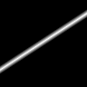
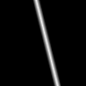
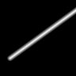
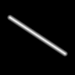
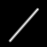
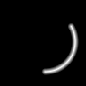
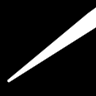

# Curves

Curves describe one-dimensional geometry in 2D space: infinite lines, half-lines, bounded segments, circles, and arcs.
They live in the `Akeldov.Math.Spatial2D.Curves` namespace and are used by contours, regions, fields, and rasterizers.

Every curve can measure point distance, project a point onto itself, and report intersections with a ray.
Parameterized curves additionally expose a length-based curve coordinate through `GetPoint` and `ProjectWithParameter`.

Angles are expressed in radians by default. Degree-based members use the `Deg` suffix.

The images below are distance rasters produced by the curve rasterizers: bright pixels are close to the curve and dark pixels are farther away.

| Non-Parameterized | Parameterized | Coordinate Domain | Notes |
|---|---|---|---|
| `Line` | `ParametricLine` | `(-inf, +inf)` | Infinite line; parameterized version adds origin and direction. |
| - | `Ray` | `[0, +inf)` | Half-line, inherently directed from its origin. |
| `Segment` | `ParameterizedSegment` | `[0, Length]` | `Segment` is endpoint-order agnostic; `ParameterizedSegment` has start/end direction. |
| `Circle` | - | - | Full circumference; distance/projection is to the ring, not a filled disk. |
| `Arc` | `ParameterizedArc` | `[0, Length]` | Bounded angular span; parameterized version adds traversal direction. |

## Linear Curves

Use linear curves when the shortest path to a point is measured against straight geometry.

<p>
  
  
  
  
  
</p>

- `Line` is an infinite geometric line. It has no start point and no curve coordinate.
- `ParametricLine` is the same infinite geometry with an `Origin`, `Direction`, and signed curve coordinate.
- `Ray` starts at an origin and extends in one direction. Its curve coordinate starts at `0`.
- `Segment` is a finite two-endpoint curve without a traversal direction.
- `ParameterizedSegment` is a directed finite path whose coordinate runs from `0` to `Length`.

```csharp
using System;
using Akeldov.Math.Spatial2D;
using Akeldov.Math.Spatial2D.Curves;

var line = new Line(
    new PointXY(0f, 0f),
    new PointXY(10f, 0f));

var parametricLine = new ParametricLine(
    line,
    referencePoint: new PointXY(2f, 0f));

var ray = new Ray(new PointXY(0f, 0f), angle: MathF.PI / 6f);

var segment = new ParameterizedSegment(
    new PointXY(0f, 0f),
    new PointXY(10f, 0f));

CurveProjection lineProjection = line.Project(new PointXY(4f, 3f));
ParameterizedCurveProjection rayProjection = ray.ProjectWithParameter(new PointXY(4f, 3f));
ParameterizedCurveProjection segmentProjection = segment.ProjectWithParameter(new PointXY(4f, 3f));
```

`Project` returns the closest point and distance.
`ProjectWithParameter` also returns `CurveCoordinate`, measured in world coordinate units along the curve.

```csharp
PointXY projectedPoint = segmentProjection.ProjectedPoint;
float curveCoordinate = segmentProjection.CurveCoordinate;
float distance = segmentProjection.Distance;

PointXY halfway = segment.GetPoint(segment.Length * 0.5f);
```

## Circular Curves

Use circular curves for distance to a circumference or a bounded angular span.

<p>
  
  
  
</p>

- `Circle` measures distance to the circumference, not to a filled disk.
- `Arc` is a bounded part of a circle between `StartAngle` and `EndAngle`.
- `ParameterizedArc` adds `AngularDirection` and a curve coordinate from the start point along the arc.

```csharp
using System;
using Akeldov.Math.Spatial2D;
using Akeldov.Math.Spatial2D.Curves;

var circle = new Circle(
    center: new PointXY(0f, 0f),
    radius: 5f);

var arc = new Arc(
    center: new PointXY(0f, 0f),
    radius: 5f,
    startAngle: 0f,
    endAngle: MathF.PI);

var pathArc = new ParameterizedArc(
    center: new PointXY(0f, 0f),
    radius: 5f,
    startAngle: 0f,
    endAngle: MathF.PI,
    angularDirection: AngularDirection.Counterclockwise);

float circleDistance = circle.Distance(new PointXY(3f, 0f));
bool isInsideArcAngle = arc.IsWithinAngularRegion(new PointXY(1f, 1f));
PointXY arcMidpoint = pathArc.GetPoint(pathArc.Length * 0.5f);
```

Equal arc input angles create a zero-length arc.
An end angle one full turn after the start angle creates a full circle, even though normalized start and end angles are equal.

## Parameterized Rendering

Parameterized curves are useful when sampling needs to vary along the curve.
The rasterizers can use the curve coordinate to change thickness, falloff, or influence along a path.

<p>
  
  
  
  
</p>

```csharp
using System;
using Akeldov.Math.Spatial2D;
using Akeldov.Math.Spatial2D.Curves;
using Akeldov.Math.Spatial2D.Imaging;
using Akeldov.Math.Spatial2D.Rasterization;

var pathArc = new ParameterizedArc(
    center: new PointXY(0f, 0f),
    radius: 2f,
    startAngle: -MathF.PI / 4f,
    endAngle: 5f * MathF.PI / 4f,
    angularDirection: AngularDirection.Counterclockwise);

var grid = new RasterGrid(
    origin: new PointXY(-3f, -3f),
    size: new VectorXY(6f, 6f),
    resolution: new VectorXYInt(96, 96));

var rasterizer = new ParameterizedCurveDistanceGray8BitRasterizer(
    (distance, curveCoordinate) =>
    {
        float thickness = 0.05f + MathF.Min(curveCoordinate * 0.065f, 0.42f);
        float normalized = 1f - System.Math.Clamp((distance - thickness) / 0.08f, 0f, 1f);
        return (byte)MathF.Round(normalized * byte.MaxValue);
    });

Gray8BitRaster raster = pathArc.Rasterize(grid, rasterizer);
raster.SaveAsPng("arc-thickness.png");
```

## Ray Intersections

`GetRayIntersections` returns a new mutable list of intersection points in the forward direction of the ray.
This is useful for contour enclosure, ray casting, and custom visibility checks.

```csharp
using System.Collections.Generic;
using Akeldov.Math.Spatial2D;
using Akeldov.Math.Spatial2D.Curves;

var circle = new Circle(
    center: new PointXY(0f, 0f),
    radius: 5f);

var rayCaster = new Ray(new PointXY(-10f, 0f), angle: 0f);
List<PointXY> hits = circle.GetRayIntersections(rayCaster);
```

The `geometryEpsilon` argument is measured in world coordinate units and controls geometric comparisons near tangencies, collinear overlaps, and endpoints.

## Contours

Contours are closed boundaries made from bounded parameterized curves and live in the `Akeldov.Math.Spatial2D.Contours` namespace.
Each curve must continue from the previous curve, and the final curve must close the contour.

```csharp
using System;
using Akeldov.Math.Spatial2D;
using Akeldov.Math.Spatial2D.Contours;
using Akeldov.Math.Spatial2D.Curves;

var contour = new Contour(new IFinitePath[]
{
    new ParameterizedArc(
        center: new PointXY(0f, 0f),
        radius: 5f,
        startAngle: 0f,
        endAngle: 2f * MathF.PI,
        angularDirection: AngularDirection.Counterclockwise)
});

bool isInside = contour.Encloses(new PointXY(3f, 0f));
```

## Helpers

Curve extension methods include:

- `Shorten` and `Extend` for segments.
- `PerpendicularAt` and `IsSameSide` for lines.
- `CreateFilletArc` and `CreateCornerTangentCircle` for corner construction.
