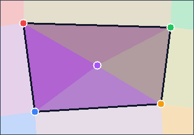

# Influence Source Culling

Culling selects a local subset of sources before the sampler computes a value. This is useful when the field should be driven by nearby geometric neighborhoods instead of every source.

The examples below use the same source shape:

```csharp
using Akeldov.Math.Spatial2D;
using Akeldov.Math.Spatial2D.Fields;

var sources = new[]
{
    new FloatPointInfluenceSource(1f, new PointXY(12f, 12f), 0f),
    new FloatPointInfluenceSource(1f, new PointXY(88f, 14f), 25f),
    new FloatPointInfluenceSource(1f, new PointXY(18f, 58f), 50f),
    new FloatPointInfluenceSource(1f, new PointXY(83f, 54f), 75f),
    new FloatPointInfluenceSource(1f, new PointXY(50f, 34f), 100f)
};
```

## Delaunay Culling

`DelaunayCuller<TPointSource>` selects the Delaunay triangle containing the sampled point. Outside the triangulated area, it falls back to the nearest convex hull feature.

The current culler implementation uses float geometry with the library geometry tolerance. It builds the triangulation up front, then checks triangles linearly for each sampled point. It is intended for moderate source counts; for very large source sets, benchmark the workload before relying on it in a hot path.

```csharp
var sampler = new BarycentricFloatSampler<FloatPointInfluenceSource>();
var culler = new DelaunayCuller<FloatPointInfluenceSource>(sources);
var field = new FloatPointInfluenceField(sampler, sources, culler);

float value = field.Sample(new PointXY(40f, 30f));
```


