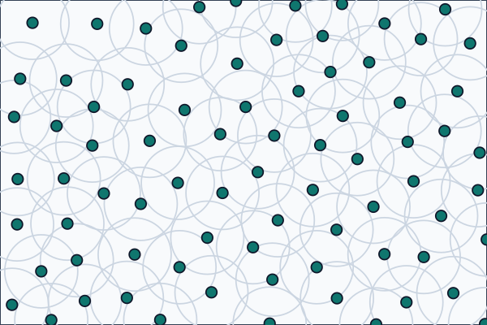
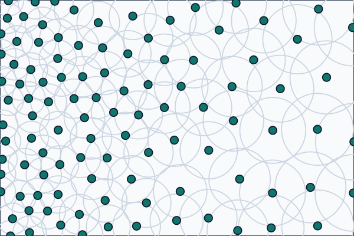

# Poisson Disk Sampling

`PoissonDiskPointSampler` generates points in a rectangular 2D field while keeping a minimum distance between accepted samples.

## Constant Minimal Distance

Use a single minimal distance when the whole field should have the same sample density.

```csharp
using Akeldov.Math.Spatial2D;
using Akeldov.Math.Spatial2D.Sampling.Point.PoissonDisk;

var sampler = new PoissonDiskPointSampler(new Random(12345), maxAttempts: 30);

IReadOnlyList<PoissonDiskPointSample> samples =
    sampler.Sample(new VectorXY(120f, 80f), minimalDistance: 9f);
```



## Variable Minimal Distance

Pass an `IFloatField` when the minimal distance should depend on the sampled position.

```csharp
using Akeldov.Math.Spatial2D;
using Akeldov.Math.Spatial2D.Fields;
using Akeldov.Math.Spatial2D.Sampling.Point.PoissonDisk;

var sampler = new PoissonDiskPointSampler(new Random(12345), maxAttempts: 30);
var distanceField = new HorizontalDistanceField();

IReadOnlyList<PoissonDiskPointSample> samples =
    sampler.Sample(new VectorXY(120f, 80f), distanceField);

public sealed class HorizontalDistanceField : IFloatField
{
    public float Min => 6f;
    public float Max => 14f;

    public float Sample(VectorXY point)
    {
        float t = point.X / 120f;
        return Min + (Max - Min) * t;
    }
}
```



## Tuning

`maxAttempts` controls how many candidates are tried around an active point before the sampler retires that point. Higher values can produce denser point sets, but take more work.

The minimal distance must always be positive. If a field returns zero or a negative value for a sampled point, sampling fails with an exception.

