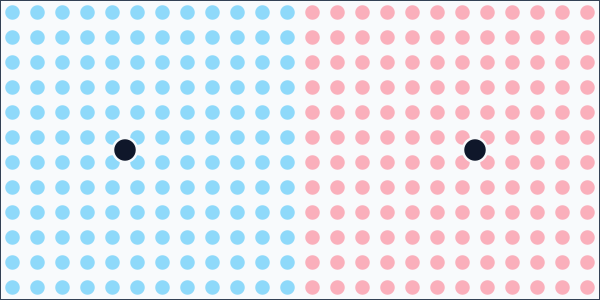
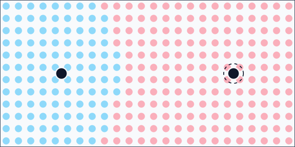

# Voronoi Partitioning

`VoronoiPartitioner<TItem>` assigns positioned items to the closest configured site.

Items must implement `IHasPosition2D`.

```csharp
using Akeldov.Math.Spatial2D;

public sealed class MapCell : IHasPosition2D
{
    public MapCell(string id, VectorXY center)
    {
        Id = id;
        Center = center;
    }

    public string Id { get; }
    public VectorXY Center { get; }
}
```

## Equal Site Power

Use equal powers when each site should compete by distance alone.

```csharp
using Akeldov.Math.Spatial2D;
using Akeldov.Math.Spatial2D.Partitioning.Voronoi;

var sites = new[]
{
    new Site(new VectorXY(25f, 30f), power: 1f),
    new Site(new VectorXY(95f, 30f), power: 1f)
};

var partitioner = new VoronoiPartitioner<MapCell>(
    sites,
    EmptyCellPolicy.LeaveAsIs);

IReadOnlyList<VoronoiCell<MapCell>> cells = partitioner.Partition(items);
```



## Weighted Site Power

Increase a site's `Power` to let it claim a larger region.

```csharp
using Akeldov.Math.Spatial2D;
using Akeldov.Math.Spatial2D.Partitioning.Voronoi;

var sites = new[]
{
    new Site(new VectorXY(25f, 30f), power: 1f),
    new Site(new VectorXY(95f, 30f), power: 2f)
};

var partitioner = new VoronoiPartitioner<MapCell>(
    sites,
    EmptyCellPolicy.LeaveAsIs);

IReadOnlyList<VoronoiCell<MapCell>> cells = partitioner.Partition(items);
```



## Power Edge Cases

At least one site must have positive power. A zero-power site only receives items that are located at that site position.

If an item is located at a site position, that site is selected before any weighted-distance comparison. If no site contains the item and one or more sites have `float.PositiveInfinity` power, the nearest infinite-power site is selected. Otherwise, sites compete by squared distance divided by squared power.

## Empty Cell Policy

Use `EmptyCellPolicy` to choose how empty cells are handled:

- `ThrowException`
- `Exclude`
- `LeaveAsIs`
